# 接机页面前后端流程图

这份图用于给客服快速理解接机页面从用户浏览、提交表单、后端保存，到客服后台处理的完整链路。

```mermaid
graph TB
    start["用户进入接机服务页<br/>pickup.html"] --> readInfo["阅读价格、规则、等待时间和客服联系方式"]
    readInfo --> boardChoice{"是否已有合适拼车班次"}

    boardChoice -->|有合适班次| board["查看公开拼车板<br/>transport-board.html"]
    board --> join["用户按 Group ID 联系客服<br/>或通过拼车加入流程提交"]
    join --> csReview["客服人工审核并确认"]

    boardChoice -->|没有合适班次| formPage["进入接机表单页<br/>pickup-form.html"]

    subgraph frontend["前端页面和浏览器处理"]
        formPage --> authHydrate["读取登录账号资料<br/>自动带入姓名、邮箱、微信、电话"]
        authHydrate --> fillForm["用户填写接机或送机信息<br/>机场、航站楼、航班、时间、地址、行李"]
        fillForm --> clientValidate["前端校验必填项和英国时间<br/>生成可复制的提交摘要"]
        clientValidate --> futureCheck["请求个人未来订单<br/>my-transport-requests"]
        futureCheck --> confirmDup{"是否已有未来有效订单提示"}
        confirmDup -->|用户取消| stopClient["停止提交<br/>保留摘要"]
        confirmDup -->|用户确认继续| submitApi["提交到公共接口<br/>POST /api/public/transport-request-submit"]
        clientValidate -->|表单不完整| fixForm["提示用户补全后重新提交"]
        fixForm --> fillForm
    end

    subgraph backend["后端公共接口处理"]
        submitApi --> route["api/public/[...action].js<br/>分发到 transport-request-submit"]
        route --> requireLogin{"是否已登录"}
        requireLogin -->|否| loginError["返回未登录错误"]
        requireLogin -->|是| profileCheck{"账号资料是否完整"}
        profileCheck -->|否| profileError["返回请补全资料"]
        profileCheck -->|是| normalize["整理和校验提交数据<br/>服务类型、航班号、时间、地址"]
        normalize --> duplicateCheck{"是否违反订单限制"}
        duplicateCheck -->|重复同单或同类未来单| duplicateError["返回重复订单提示<br/>建议联系客服修改原单"]
        duplicateCheck -->|同账号未来单超过上限| limitError["返回最多保留三张未来有效单"]
        duplicateCheck -->|通过| createRequest["写入 transport_requests<br/>状态 published"]
        createRequest --> createGroup["自动创建 transport_groups<br/>分配 Group ID"]
        createGroup --> addMember["写入 transport_group_members<br/>发起人成为组内成员"]
        addMember --> sendEmail["发送订单提交邮件<br/>提示扫码联系客服审核"]
        sendEmail --> apiSuccess["返回订单编号、Group ID、状态"]
    end

    subgraph customerService["客服后台处理"]
        apiSuccess --> userNotice["前端弹窗显示提交成功<br/>用户复制姓名、订单编号、Group ID 给客服"]
        userNotice --> adminList["客服打开接送机订单后台<br/>transport-admin-requests.html"]
        adminList --> adminGroup["查看或编辑拼车组<br/>transport-admin-groups.html"]
        adminGroup --> matchPeople["客服按日期、机场、航站楼、时间匹配同行人"]
        matchPeople --> payment["确认人数、价格和付款状态"]
        payment --> dispatch["整理派车摘要<br/>通知司机和学生"]
    end

    loginError --> userFix["用户登录后重试"]
    profileError --> userProfile["用户到个人中心补全资料后重试"]
    duplicateError --> contactCs["用户联系客户服务调整原订单"]
    limitError --> contactCs
    apiSuccess --> boardUpdate["公开拼车板刷新后显示可拼信息<br/>只展示公开安全字段"]
    createGroup --> boardUpdate

    classDef page fill:#e7f5ff,stroke:#1971c2,color:#0b3058;
    classDef frontend fill:#d3f9d8,stroke:#2f9e44,color:#153b1d;
    classDef backend fill:#e5dbff,stroke:#5f3dc4,color:#2f1b66;
    classDef decision fill:#fff4e6,stroke:#e67700,color:#5f3200;
    classDef error fill:#ffe3e3,stroke:#c92a2a,color:#5b1111;
    classDef admin fill:#c5f6fa,stroke:#0c8599,color:#073b44;

    class start,readInfo,board,formPage,page page;
    class authHydrate,fillForm,clientValidate,futureCheck,submitApi,fixForm,userNotice frontend;
    class route,normalize,createRequest,createGroup,addMember,sendEmail,apiSuccess,boardUpdate backend;
    class boardChoice,confirmDup,requireLogin,profileCheck,duplicateCheck decision;
    class stopClient,loginError,profileError,duplicateError,limitError,userFix,userProfile,contactCs error;
    class csReview,adminList,adminGroup,matchPeople,payment,dispatch admin;
```

## 给客服看的简版说明

1. 用户先看 `pickup.html` 的价格和规则，再看公开拼车板。
2. 如果没有合适班次，用户进入 `pickup-form.html` 填表。
3. 表单会先在浏览器里检查必填项、英国时间，并生成一份可复制摘要。
4. 提交前系统会查用户自己的未来接送机订单，提醒是否已有相关订单。
5. 后端必须确认用户已登录、账号资料完整、航班号格式正确，并检查是否重复提交。
6. 通过后系统会生成订单编号和 Group ID，并把订单、拼车组、组成员关系写入数据库。
7. 用户会看到提交成功弹窗和邮件提醒，但仍需要加客服微信并发送姓名、订单编号、Group ID。
8. 客服在后台根据订单和 Group ID 审核、匹配同行人、确认价格付款，最后安排派车。

## 关键文件

- `pickup.html`: 接机说明页和公开拼车入口。
- `pickup-form.html`: 用户提交接机或送机需求的表单页。
- `pickup-form.js`: 前端校验、摘要生成、个人未来订单检查、提交公共接口。
- `api/public/[...action].js`: 公共 API 分发入口。
- `public-api-handlers/transport-request-submit.js`: 用户提交接送机订单的后端入口。
- `api/_lib/transport-group-lifecycle.js`: 创建订单后自动创建 Group ID 和组成员关系。
- `public-api-handlers/transport-board.js`: 公开拼车板数据展示边界。
- `transport-admin.js`: 客服后台查看订单、拼车组、付款和派车摘要的主要交互逻辑。
